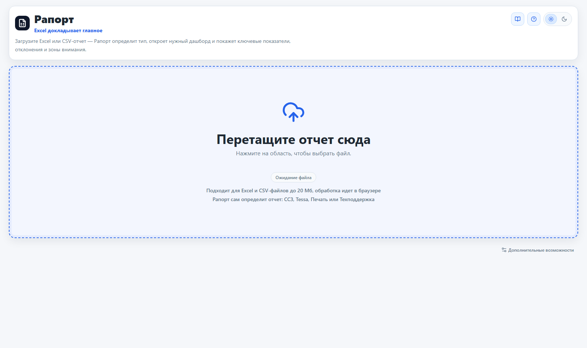
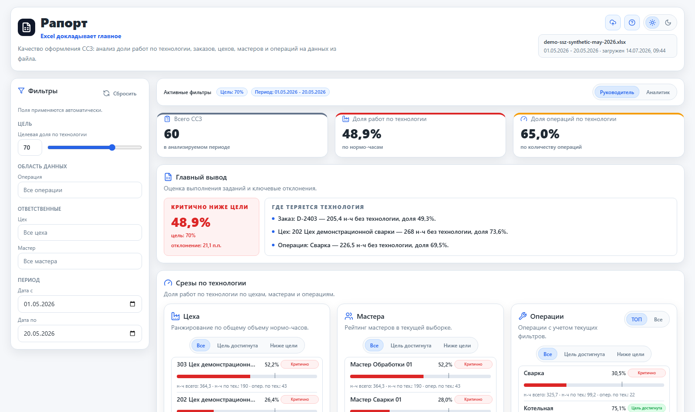
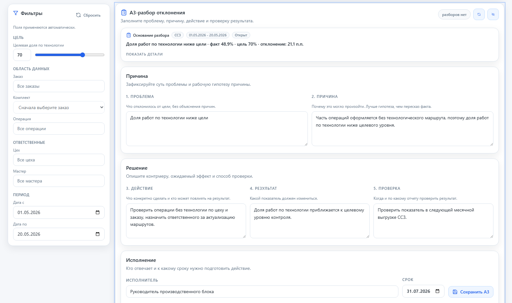
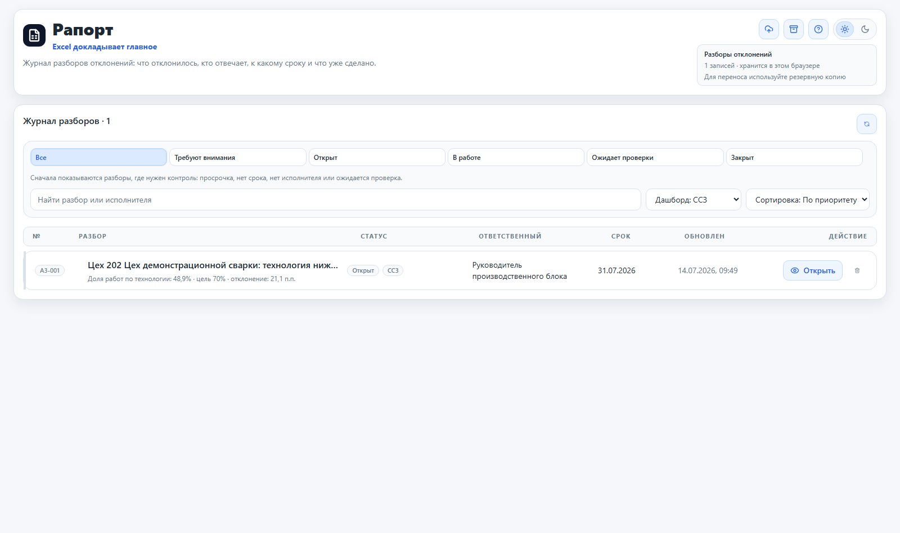
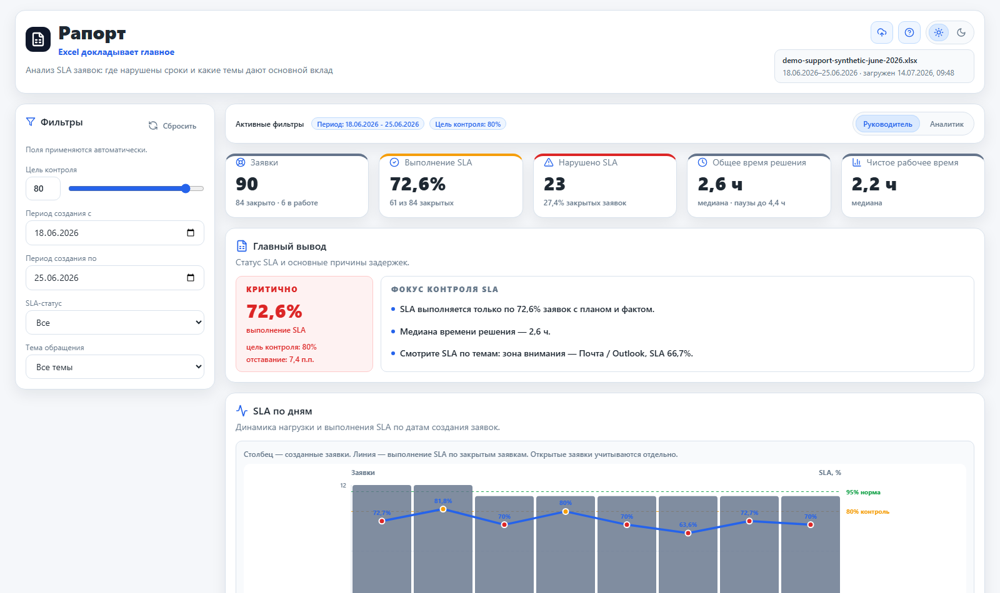
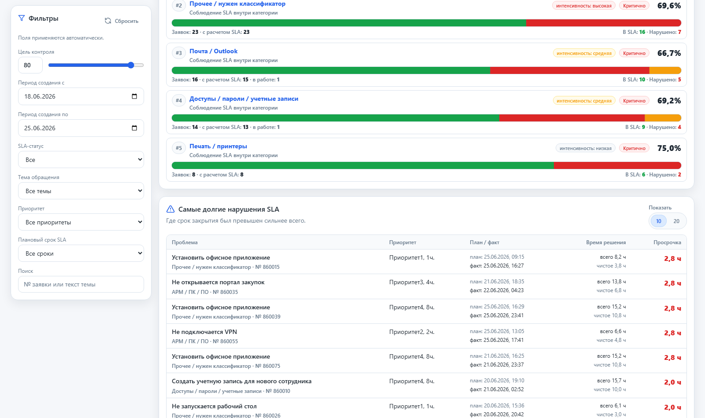
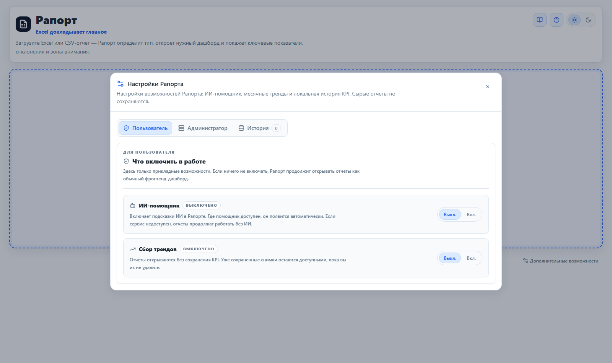
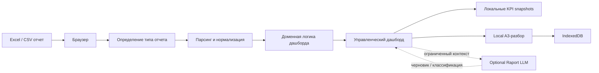

# Рапорт

**Рапорт** — линейка легких локальных аналитических инструментов для проверки управленческих сценариев на Excel/CSV-выгрузках.

> Excel докладывает главное

Рапорт не пытается заменить BI-платформу. Это управляемый класс browser-only дашбордов, который помогает быстро проверить продуктовую или управленческую гипотезу: загрузить отчет, увидеть отклонения, найти зону внимания и оформить A3-разбор без отправки исходных данных на сервер.

[Открыть демо](https://shantarinav.github.io/raport-product-line/) · [Архитектура](docs/ARCHITECTURE.md) · [Roadmap](docs/ROADMAP.md) · [ADR](docs/adr/README.md) · [Чему научил проект](docs/LESSONS_LEARNED.md)

## Бизнес-проблема

На промышленных предприятиях значительная часть управленческой информации остается в Excel, CSV-выгрузках и локальных отчетах. Для каждой новой гипотезы не всегда рационально запускать полноценный BI-проект: долго согласовывать витрины, источники, роли, интеграции и регламенты.

Рапорт закрывает промежуточный слой: безопасно проверить управленческий сценарий на локальной выгрузке, понять ценность дашборда и только затем решать, стоит ли переносить сценарий в промышленный BI-контур.

## Для кого

- **CIO / руководитель цифровизации** — проверка цифровых гипотез до тяжелой интеграции в BI.
- **Руководитель производства** — зоны внимания, отклонения и A3-разборы по операционным данным.
- **Аналитик / экономист** — быстрый разбор Excel/CSV-выгрузок без подготовки отдельной витрины.
- **ИТ и техподдержка** — контроль SLA, хвоста просрочек и качества потока заявок.
- **Администратор печати** — контроль нецелевой печати и опциональная локальная ИИ-проверка.

## Что это не делает

Рапорт сознательно не является:

- заменой корпоративной BI-платформы;
- универсальным конструктором отчетов;
- хранилищем исходных Excel-файлов;
- системой ролей, пользователей и согласований;
- централизованным DWH или MDM;
- промышленным контуром нормативной отчетности.

Его задача — быстро и безопасно проверить управленческий сценарий, прежде чем вкладываться в тяжелую автоматизацию.

## Что уже реализовано

- `#/` — единая точка загрузки отчетов.
- `#/ssz` — качество оформления смено-суточных заданий.
- `#/tessa` — исполнительская дисциплина Tessa.
- `#/print` — контроль печати.
- `#/support` — SLA закрытых заявок техподдержки.
- `#/a3` — локальный журнал A3-разборов отклонений.
- `#/help` — короткая пользовательская справка.
- `#/ui-contract` — внутренняя страница визуального контракта.

## Пользовательский сценарий

1. Пользователь открывает статический сайт Рапорта.
2. Загружает Excel/CSV-файл через главную страницу.
3. Рапорт определяет тип отчета по содержимому, а не по имени файла.
4. Дашборд показывает KPI, главный вывод, фильтры и зоны внимания.
5. В режиме аналитика пользователь может создать A3-разбор по отклонению.
6. A3 хранится локально в браузере и может быть экспортирован в JSON.
7. Опционально пользователь включает Raport LLM для локальных ИИ-подсказок.

## Как это выглядит

Скриншоты сняты на синтетических данных из `demo-data/`.

### Главная загрузка отчета



### ССЗ: главный вывод и зона внимания



### A3-разбор отклонения



### Журнал A3-разборов



### Support: SLA и поток заявок



### Support: самые долгие нарушения SLA



### Настройки возможностей



## Архитектурная идея

Базовый Рапорт — статический фронтенд. Он должен работать без обязательного backend, авторизации, серверной базы данных и сетевой отправки исходных отчетов.

Подробнее: [docs/ARCHITECTURE.md](docs/ARCHITECTURE.md).



## Текущий стек

- React;
- TypeScript;
- Vite;
- Tailwind CSS;
- shadcn/ui primitives;
- lucide-react;
- IndexedDB для локальной истории KPI и Local A3;
- Dexie и Zod для локального A3-хранилища, схем и JSON import/export;
- xlsx для чтения Excel-файлов;
- Node.js optional backend для Raport LLM.

## Структура проекта

```txt
src/
  features/
    ssz/
    tessa/
    print/
    support/
    local-a3/
    file-loader/
    report-detector/
  pages/
    landing/
  shared/
    lib/
    styles/
    ui/
backend/
  raport-llm/
demo-data/
  ssz/
  support/
docs/
```

Основные правила:

- парсинг файла отделен от UI;
- нормализация данных отделена от React-компонентов;
- расчеты и агрегации находятся в доменных `logic`-модулях;
- повторяемые UI-паттерны переиспользуются из `src/shared/ui`;
- страницы дашбордов загружаются лениво на уровне маршрутов;
- новые дашборды должны выглядеть как часть одной линейки.

## Shared UI и визуальный контракт

Базовые компоненты:

- `PageShell`;
- `DashboardHeader`;
- `FileDropZone`;
- `MetricCard`;
- `SectionCard`;
- `ChartCard`;
- `FilterPanel`;
- `FilterStatusBar`;
- `DashboardSwitch`;
- `DataTable`;
- `ErrorState`;
- `IconLabel`.

Визуальный контракт закреплен в [docs/VISUAL_CONTRACT.md](docs/VISUAL_CONTRACT.md), а живая проверочная страница доступна по маршруту `#/ui-contract`.

## Локальная история и тренды

Рапорт хранит агрегированные KPI-снимки в IndexedDB.

Правила:

- сохраняются только числовые агрегаты;
- сырые строки отчетов не сохраняются;
- ФИО, пользователи, документы и темы не сохраняются;
- шаг тренда — месяц;
- месяц попадает в тренд только при покрытии не меньше 50%;
- snapshot с большим или равным покрытием перезаписывает старый;
- snapshot с меньшим покрытием не затирает старый;
- для Print месячные KPI считаются без печати в PDF.

## Local A3-разборы отклонений

Рапорт поддерживает локальный журнал облегченных A3-протоколов для разбора отклонений.

Принцип работы:

- кнопка `Разобрать` доступна в аналитическом режиме рядом с уже показанными отклонениями;
- A3-разбор предварительно заполняется ограниченным snapshot: тип дашборда, период, показатель, факт, цель, краткое описание отклонения, имя файла и выбранные бизнес-объекты, если они нужны для контекста;
- сырые строки Excel, полный state дашборда и исходные файлы в A3 не сохраняются;
- протоколы и lightweight snapshots хранятся в IndexedDB этого браузера;
- журнал доступен по маршруту `#/a3` и из шапки главной страницы/дашбордов;
- журнал поддерживает фильтры, поиск, статусы, экспорт всего журнала и импорт JSON-архива;
- в v0.1 комментарии не входят в пользовательский UX A3; протокол ведет проблему, причину, решение, исполнителя, срок, ожидаемый результат и критерий проверки.

Важно: A3-разборы хранятся локально на компьютере пользователя. Для резервного копирования используется экспорт журнала в JSON.

## Демонстрационные данные

Безопасные синтетические файлы находятся в `demo-data/`.

Доступные наборы:

- `demo-data/ssz/demo-ssz-synthetic-may-2026.xlsx` — синтетический отчет ССЗ для демонстрации дашборда `#/ssz`.
- `demo-data/support/demo-support-synthetic-june-2026.xlsx` — синтетический отчет техподдержки для демонстрации дашборда `#/support` и формата с `SLA_work_time`.

Эти файлы можно загрузить через главную страницу `#/`, чтобы показать:

- автоматическое распознавание типа отчета;
- KPI и управленческий главный вывод;
- фильтры и режимы `Руководитель` / `Аналитик`;
- зоны внимания и детализацию отклонений;
- A3-разборы по выявленным проблемам;
- для ССЗ — срезы по цехам, мастерам, заказам и операциям;
- для Support — SLA по дням, SLA по темам, общее и чистое время решения, хвост просрочек.

Для локальной проверки и публичных демонстраций используются только синтетические наборы из `demo-data/`.

## Безопасность данных

В проекте используются только синтетические демонстрационные данные.

Правило проекта простое: в репозитории и локальных проверках используются только синтетические XLSX/CSV-наборы из `demo-data/`. Каждый такой набор должен иметь описание назначения, периода и состава данных.

Внутри приложения действуют дополнительные ограничения:

- исходные Excel/CSV-файлы обрабатываются локально в браузере;
- локальная история не сохраняет сырые строки отчетов;
- A3 сохраняет ограниченный snapshot отклонения, а не весь набор данных;
- optional Raport LLM получает только ограниченный контекст конкретной задачи;
- при недоступном backend дашборды продолжают работать без ИИ.

## Опциональный ИИ-сервис Raport LLM

Фронтенд Рапорта остается самостоятельным статическим приложением: публикация `dist/` не требует Node.js, Ollama или SQLite. `backend/raport-llm/` — необязательный локальный ИИ-сервис для дополнительных возможностей.

Сейчас Raport LLM используется в двух сценариях:

- `Print` — уточняет словарные кандидаты личной печати локальной моделью;
- `A3-разборы` — предлагает черновики формулировок проблемы, гипотез причин, контрмер, ожидаемого результата и критерия проверки.

Принцип работы:

- фронтенд не обращается к Ollama напрямую;
- пользователь явно включает ИИ-помощник в настройках;
- результат ИИ всегда является черновиком для проверки пользователем;
- при ошибке ИИ Рапорт продолжает работать без ИИ-подсказок.

Локальный запуск:

```bash
npm run backend:raport-llm
```

Переменные окружения сервиса см. в `backend/raport-llm/.env.example`. Подробности развертывания: [backend/raport-llm/DEPLOYMENT.md](backend/raport-llm/DEPLOYMENT.md).

## Критерии качества

Перед публикацией изменений используется:

- `npm run typecheck` — строгая проверка TypeScript;
- `npm test` — unit-тесты доменной логики, импорта, A3 и Raport LLM;
- `npm run build` — production-сборка;
- визуальный контракт [docs/VISUAL_CONTRACT.md](docs/VISUAL_CONTRACT.md) и страница `#/ui-contract`;
- синтетические демо-данные как единственный допустимый проверочный набор.

Для optional backend дополнительно проверяются health-check, настройки окружения и безопасный fallback фронтенда при недоступном сервисе.

## Запуск для разработки

```bash
npm install
npm run dev
```

## Проверка

```bash
npm run check
```

Команда выполняет проверку типов, unit-тесты и production-сборку.

## Production-сборка

```bash
npm run build
```

После сборки статические файлы находятся в `dist/`.

## Публикация

Production-сборка не привязана к домену или папке. Ее можно разместить, например:

```txt
https://example.ru/
https://example.ru/any/folder/
```

На сервер нужно переносить содержимое `dist/`.

Приложение использует hash-routing, поэтому серверу не нужен отдельный fallback для маршрутов дашбордов.

Примеры адресов после публикации:

```txt
https://site/folder/#/print
https://site/folder/#/ssz
https://site/folder/#/support
```

## Известный риск зависимостей

`npm audit --omit=dev` сообщает о high-severity advisories в пакете `xlsx`. Автоматического исправления npm не предлагает. Сейчас Excel-файлы обрабатываются локально в браузере, ограничение загрузки — до 20 Мб.

## Документы проекта

- [Архитектура](docs/ARCHITECTURE.md)
- [ADR-журнал](docs/adr/README.md)
- [Roadmap](docs/ROADMAP.md)
- [Чему научил проект](docs/LESSONS_LEARNED.md)
- [Визуальный контракт](docs/VISUAL_CONTRACT.md)
- [План Local A3](docs/LOCAL_A3_PLAN.md)
- [Raport LLM](backend/raport-llm/README.md)
