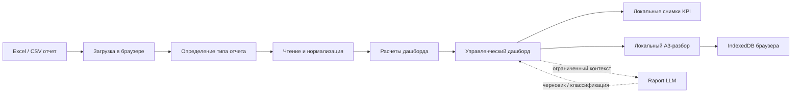

# Архитектура Рапорта

Рапорт строится по принципу **сначала браузерная версия**: базовое приложение остается статическим веб-приложением и работает без обязательной серверной части.

Это сознательное архитектурное ограничение. Оно позволяет использовать Рапорт как легкий инструмент проверки управленческих сценариев на локальных Excel/CSV-выгрузках без запуска полноценного серверного контура.

## Поток данных

## Ключевые архитектурные решения

- исходный файл не отправляется на сервер;
- дашборды не хранят сырые строки в локальной истории;
- A3 сохраняет ограниченный снимок отклонения, а не весь отчет;
- Raport LLM подключается только после явного включения пользователем;
- статическая публикация использует маршруты через `#`, чтобы работать в любой папке сайта;
- командный режим с пользователями и ролями поставлен на паузу, пока не доказана ценность сценария локального A3.

## Слои приложения

- `src/features/*/import` — чтение и нормализация отчетов;
- `src/features/*/logic` — расчеты и бизнес-правила;
- `src/features/*/components` — отображение дашбордов;
- `src/shared/ui` — визуальный контракт и переиспользуемые компоненты;
- `src/shared/lib` — общие утилиты, история KPI и логика снимков;
- `src/features/local-a3` — локальные A3-разборы;
- `backend/raport-llm` — необязательное локальное ИИ-расширение.

## Почему не BI-платформа

Рапорт не строит универсальную модель данных, не управляет ролями и не хранит корпоративные витрины. Он нужен до BI-проекта: проверить сценарий, выявить управленческий смысл показателя и понять, стоит ли переносить его в промышленный контур.

## Границы хранения данных

Рапорт различает три типа данных:

1. **Исходный отчет** — загружается и обрабатывается в браузере, не сохраняется в приложении.
2. **Снимок KPI** — агрегированные числовые показатели для локальных трендов.
3. **Снимок A3** — ограниченный контекст конкретного отклонения для управленческого разбора.

Сырые строки Excel, полное состояние дашборда, файл целиком и пользовательские секреты не должны попадать в локальный A3 или историю KPI.

## Raport LLM

Raport LLM является расширением, а не обязательной частью архитектуры. Веб-интерфейс остается работоспособным без него.

Сервис может быть запущен локально на ПК пользователя или размещен в небольшой корпоративной сети. Он получает только ограниченный контекст конкретной задачи: например, название документа для Print-классификации или снимок A3-разбора для черновика формулировки.
