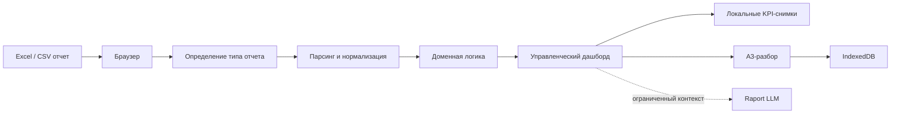

# Рапорт как управленческий инженерный кейс

Рапорт — не попытка написать собственную BI-платформу. Это архитектурный эксперимент и продуктовая гипотеза: можно ли быстро, безопасно и дешево проверять управленческие сценарии на Excel/CSV-выгрузках до запуска тяжелого BI-проекта.

> Excel докладывает главное

## Управленческая проблема

На промышленном предприятии многие важные сигналы остаются в локальных отчетах: смено-суточные задания, заявки техподдержки, печать, исполнительская дисциплина. Такие данные уже есть, но между Excel-файлом и управленческим действием часто появляется разрыв:

- отчет нужно вручную открыть и интерпретировать;
- отклонения не всегда видны руководителю;
- причина проблемы не фиксируется рядом с показателем;
- для проверки гипотезы приходится ждать полноценного BI-контура.

Рапорт закрывает промежуточный слой: загрузить выгрузку, увидеть главное, найти зону внимания и оформить A3-разбор.

## Продуктовая гипотеза

Легкий локальный дашборд может быть не заменой BI, а инструментом проверки управленческой ценности показателя.

Если сценарий полезен в Рапорте, его можно переносить в промышленный контур: согласовывать витрины, роли, интеграции и регламенты уже на подтвержденной бизнес-логике.

## Для кого

- **CIO / руководитель цифровизации** — проверить цифровой сценарий до дорогой интеграции.
- **Руководитель производства** — увидеть отклонение и запустить разбор.
- **Аналитик** — быстро превратить выгрузку в управленческий обзор.
- **ИТ и техподдержка** — контролировать SLA и хвост просрочек.
- **Администратор печати** — найти нецелевую печать и проверить кандидатов локальным ИИ.

## Что реализовано

- Единая загрузка Excel/CSV на главной странице.
- Автоматическое определение типа отчета по содержимому файла.
- Дашборды для ССЗ, Tessa, Print и Support.
- Режимы «Руководитель» и «Аналитик».
- Главный вывод, KPI, фильтры и зоны внимания.
- Локальный журнал A3-разборов отклонений.
- Локальная история KPI и месячные тренды без сохранения исходных строк.
- Необязательный Raport LLM для ИИ-подсказок и уточнения личной печати.
- Синтетические демонстрационные данные и публичные скриншоты.

## Архитектурная позиция

Базовый Рапорт — статический frontend. Он работает без обязательного backend, авторизации, серверной базы и сетевой отправки исходных отчетов.

Ключевое решение: сначала доказать ценность сценария в Local-режиме, а не преждевременно строить серверную платформу с пользователями, ролями и общей базой.

## Сознательно исключено

Рапорт не делает:

- замену корпоративного BI;
- универсальный конструктор отчетов;
- хранение исходных Excel-файлов;
- роли, пользователей и авторизацию в Local-версии;
- централизованное корпоративное хранилище;
- обязательный backend для базовых дашбордов.

Этот список ограничений важен: он показывает не недостаток функции, а сознательную продуктовую границу.

## Безопасность данных

В репозитории используются только синтетические демонстрационные данные.

В приложении действуют ограничения:

- исходный файл обрабатывается в браузере;
- сырые строки не сохраняются в локальной истории;
- A3 хранит ограниченный snapshot отклонения, а не весь отчет;
- Raport LLM получает только ограниченный контекст конкретной задачи;
- при недоступном ИИ-сервисе дашборды продолжают работать без ИИ.

## Критерии качества

Проект сопровождается как продукт, а не как разовый скрипт:

- единый визуальный контракт;
- общий набор UI-компонентов;
- доменная логика отделена от React-компонентов;
- lazy loading страниц дашбордов;
- тесты доменной логики, импорта, A3 и ИИ-интеграции;
- production build перед публикацией;
- ADR-журнал архитектурных решений;
- синтетические данные для демонстрации и проверки.

## Что показывает проект

Рапорт демонстрирует не только умение написать код, но и инженерное мышление уровня CIO:

- выделять управленческую проблему;
- ограничивать scope;
- проектировать безопасные границы данных;
- проверять продуктовую гипотезу до тяжелой автоматизации;
- связывать дашборд с управленческим действием через A3;
- сопровождать проект документацией, ADR, релизами и визуальным контрактом.

## Демо и материалы

- [Публичное демо](https://shantarinav.github.io/raport-product-line/)
- [README](../README.md)
- [Архитектура](ARCHITECTURE.md)
- [Журнал архитектурных решений](adr/README.md)
- [Roadmap](ROADMAP.md)
- [Чему научил проект](LESSONS_LEARNED.md)

