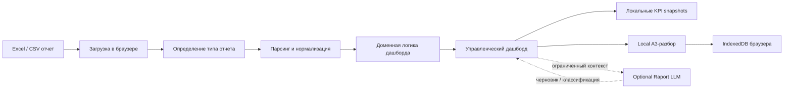

# GitHub Management Engineering Showcase Implementation Plan

> **For agentic workers:** REQUIRED SUB-SKILL: Use superpowers:subagent-driven-development (recommended) or superpowers:executing-plans to implement this plan task-by-task. Steps use checkbox (`- [ ]`) syntax for tracking.

**Goal:** Reframe the Raport GitHub repository from a code showcase into an executive-facing showcase of management engineering, product architecture, data safety and operational discipline.

**Architecture:** Keep the static frontend and optional Raport LLM behavior unchanged. This plan changes public documentation, repository metadata, screenshots and decision records only. Technical details remain available, but the top-level GitHub experience becomes an executive case study.

**Tech Stack:** Markdown documentation, Mermaid diagrams, GitHub Pages link, existing demo data, existing React app screenshots, GitHub repository metadata.

---

## Current State

**Repository:** `shantarinav/raport-product-line`

**Already present:**
- `README.md` with product idea, dashboards, architecture, local history, A3, demo data, safety, optional Raport LLM, build and deploy commands.
- `docs/VISUAL_CONTRACT.md` with visual contract.
- `docs/LOCAL_A3_PLAN.md` with Local A3 design.
- `backend/raport-llm/README.md` and `backend/raport-llm/DEPLOYMENT.md`.
- GitHub Pages deployment: `https://shantarinav.github.io/raport-product-line/`.
- Synthetic demo data for SSZ and Support.

**Missing or weak for the desired positioning:**
- README starts as technical product documentation, not as executive case study.
- No concise business-problem section framed around management scenarios.
- No explicit target-user section.
- No visual architecture diagram in public docs.
- No public ADR index.
- No public roadmap.
- No screenshots.
- No “what the project taught” section.
- No explicit “not a BI platform” section near the top.
- GitHub topics are empty.

## File Map

**Modify:**
- `README.md` — main GitHub showcase, executive-first structure.
- `.github/workflows/main.yml` — only if screenshot generation is later automated; not in first pass.

**Create:**
- `docs/ARCHITECTURE.md` — architecture narrative and Mermaid data-flow diagram.
- `docs/ROADMAP.md` — short public roadmap.
- `docs/LESSONS_LEARNED.md` — lessons from the product and architecture experiment.
- `docs/adr/README.md` — ADR index.
- `docs/adr/ADR-001-browser-only-first.md`.
- `docs/adr/ADR-002-static-hash-routing.md`.
- `docs/adr/ADR-003-no-raw-data-persistence.md`.
- `docs/adr/ADR-004-optional-llm-backend.md`.
- `docs/adr/ADR-005-local-a3-before-team-mode.md`.
- `docs/screenshots/README.md` — screenshot checklist and capture conventions.

**Later / optional:**
- `docs/screenshots/*.png` — actual screenshots after browser capture.

## Task 0: Handle Dirty Working Tree Before Documentation Work

**Files:**
- Existing dirty files from prior task:
  - `demo-data/ssz/demo-ssz-synthetic-may-2026.xlsx`
  - `demo-data/ssz/README.md`

- [ ] **Step 1: Inspect dirty state**

Run:

```bash
git status -sb
git diff -- demo-data/ssz/README.md
```

Expected: only the SSZ synthetic demo file and its README are modified.

- [ ] **Step 2: Decide how to isolate**

Recommended: commit the SSZ synthetic data correction separately before the GitHub showcase work.

Commit message:

```bash
docs: adjust ssz synthetic demo ratios
```

Reason: documentation showcase changes should not be mixed with data-correction changes.

- [ ] **Step 3: Verify after commit**

Run:

```bash
git status -sb
```

Expected: clean `main` or clean feature branch before starting README/docs work.

## Task 1: Rewrite README Top As Executive Case Study

**Files:**
- Modify: `README.md`

- [ ] **Step 1: Move the repository positioning to the first screen**

Replace the current opening with a concise executive framing:

```markdown
# Рапорт

**Рапорт** — линейка легких локальных аналитических инструментов для проверки управленческих сценариев на Excel/CSV-выгрузках.

> Excel докладывает главное

Рапорт не пытается заменить BI-платформу. Это управляемый класс browser-only дашбордов, который помогает быстро проверить продуктовую или управленческую гипотезу: загрузить отчет, увидеть отклонения, найти зону внимания и оформить A3-разбор без отправки данных на сервер.

[Открыть демо](https://shantarinav.github.io/raport-product-line/) · [Архитектура](docs/ARCHITECTURE.md) · [Roadmap](docs/ROADMAP.md) · [ADR](docs/adr/README.md)
```

- [ ] **Step 2: Add “Business problem” section**

Add after opening:

```markdown
## Бизнес-проблема

На промышленных предприятиях значительная часть управленческой информации остается в Excel, CSV-выгрузках и локальных отчетах. Для каждой новой гипотезы не всегда рационально запускать полноценный BI-проект: долго согласовывать витрины, источники, роли, интеграции и регламенты.

Рапорт закрывает промежуточный слой: безопасно проверить управленческий сценарий на локальной выгрузке, понять ценность дашборда и только затем решать, стоит ли переносить сценарий в промышленный BI-контур.
```

- [ ] **Step 3: Add “Target users” section**

```markdown
## Для кого

- **CIO / руководитель цифровизации** — проверка цифровых гипотез до тяжелой интеграции в BI.
- **Руководитель производства** — зоны внимания, отклонения и A3-разборы по операционным данным.
- **Аналитик / экономист** — быстрый разбор Excel/CSV-выгрузок без подготовки отдельной витрины.
- **ИТ и техподдержка** — контроль SLA, хвоста просрочек и качества потока заявок.
- **Администратор печати** — контроль нецелевой печати и опциональная локальная ИИ-проверка.
```

- [ ] **Step 4: Add “Not a BI platform” section**

```markdown
## Что это не делает

Рапорт сознательно не является:

- заменой корпоративной BI-платформы;
- универсальным конструктором отчетов;
- хранилищем исходных Excel-файлов;
- системой ролей, пользователей и согласований;
- централизованным DWH или MDM;
- промышленным контуром нормативной отчетности.

Его задача — быстро и безопасно проверить управленческий сценарий, прежде чем вкладываться в тяжелую автоматизацию.
```

- [ ] **Step 5: Keep technical sections, but move them lower**

Ensure the first half of README answers:
- What problem is solved?
- Who uses it?
- Why it is intentionally lightweight?
- How to try it?
- How data safety is handled?

- [ ] **Step 6: Verify links**

Run:

```bash
rg -n "docs/ARCHITECTURE|docs/ROADMAP|docs/adr" README.md
```

Expected: README links to all new public docs.

## Task 2: Add Architecture Document

**Files:**
- Create: `docs/ARCHITECTURE.md`

- [ ] **Step 1: Create architecture narrative**

Content:

```markdown
# Архитектура Рапорта

Рапорт строится по принципу browser-only first: базовое приложение остается статическим фронтендом и работает без обязательного backend.

## Поток данных



## Ключевые архитектурные решения

- исходный файл не отправляется на сервер;
- дашборды не хранят сырые строки в локальной истории;
- A3 сохраняет ограниченный snapshot отклонения, а не весь отчет;
- optional Raport LLM подключается только после явного включения пользователем;
- статическая публикация использует hash-routing, чтобы работать в любой папке сайта.

## Слои

- `src/features/*/import` — чтение и нормализация отчетов;
- `src/features/*/logic` — расчеты и бизнес-правила;
- `src/features/*/components` — отображение дашбордов;
- `src/shared/ui` — визуальный контракт и переиспользуемые компоненты;
- `src/features/local-a3` — локальные A3-разборы;
- `backend/raport-llm` — необязательное локальное ИИ-расширение.
```

- [ ] **Step 2: Verify Markdown file exists**

Run:

```bash
test -f docs/ARCHITECTURE.md
```

Expected: file exists.

## Task 3: Add Public ADR Index And Initial ADRs

**Files:**
- Create: `docs/adr/README.md`
- Create: `docs/adr/ADR-001-browser-only-first.md`
- Create: `docs/adr/ADR-002-static-hash-routing.md`
- Create: `docs/adr/ADR-003-no-raw-data-persistence.md`
- Create: `docs/adr/ADR-004-optional-llm-backend.md`
- Create: `docs/adr/ADR-005-local-a3-before-team-mode.md`

- [ ] **Step 1: Create ADR index**

`docs/adr/README.md`:

```markdown
# Архитектурные решения

Этот журнал фиксирует ключевые решения Рапорта: не как историю кода, а как историю управленческих и архитектурных компромиссов.

- [ADR-001: Browser-only first](ADR-001-browser-only-first.md)
- [ADR-002: Static publishing and hash-routing](ADR-002-static-hash-routing.md)
- [ADR-003: No raw data persistence](ADR-003-no-raw-data-persistence.md)
- [ADR-004: Optional Raport LLM backend](ADR-004-optional-llm-backend.md)
- [ADR-005: Local A3 before Team mode](ADR-005-local-a3-before-team-mode.md)
```

- [ ] **Step 2: Create ADR template structure for each ADR**

Each ADR must use:

```markdown
# ADR-XXX: Title

## Status
Accepted

## Context
...

## Decision
...

## Consequences
...
```

- [ ] **Step 3: Capture actual decisions**

ADR summaries:

- ADR-001: Base app must work as static frontend without mandatory backend.
- ADR-002: Hash routing is used so deployment works in any folder without server fallback.
- ADR-003: Local history stores aggregated KPI and bounded A3 snapshots, not raw reports.
- ADR-004: Raport LLM is optional; UI works without it and uses safe fallbacks.
- ADR-005: Team/backend/auth mode is paused; Local A3 is used first to validate management workflow.

- [ ] **Step 4: Verify ADR links**

Run:

```bash
rg -n "ADR-00" docs/adr README.md
```

Expected: all five ADRs are linked.

## Task 4: Add Roadmap

**Files:**
- Create: `docs/ROADMAP.md`

- [ ] **Step 1: Create roadmap with short management-oriented sections**

Content:

```markdown
# Roadmap

Рапорт развивается как набор легких локальных инструментов для проверки управленческих сценариев.

## Сейчас

- browser-only дашборды для ССЗ, Tessa, Print и Support;
- единая загрузка Excel/CSV;
- Local A3-разборы отклонений;
- локальная история KPI;
- optional Raport LLM для Print и A3.

## Ближайшие шаги

- добавить синтетические демо-данные для всех дашбордов;
- подготовить публичные скриншоты ключевых сценариев;
- усилить A3-помощник как методический инструмент, а не автозаполнитель;
- расширить проверки безопасности демо-данных;
- оформить набор ADR как публичный журнал решений.

## Позже

- проверить, какие сценарии стоит переносить в промышленный BI-контур;
- улучшить переносимость Raport LLM в небольшой корпоративной сети;
- развить методологию A3-разборов на базе проверенных пользовательских сценариев.
```

- [ ] **Step 2: Link from README**

Ensure README includes `[Roadmap](docs/ROADMAP.md)` near the top.

## Task 5: Add Lessons Learned

**Files:**
- Create: `docs/LESSONS_LEARNED.md`
- Modify: `README.md`

- [ ] **Step 1: Create lessons document**

Content:

```markdown
# Чему научил проект

## 1. Легкий дашборд может быть продуктовой гипотезой

Не каждый управленческий вопрос нужно сразу переводить в тяжелый BI-проект. Иногда сначала нужно проверить, действительно ли показатель помогает принимать решения.

## 2. Browser-only архитектура дисциплинирует работу с данными

Если приложение не отправляет исходные файлы на сервер, приходится явно проектировать границы хранения, snapshots и локальной истории.

## 3. A3 превращает дашборд из витрины в инструмент действия

Показатель сам по себе не меняет процесс. Полезнее связать отклонение с причиной, контрмерой, ответственным, сроком и проверкой результата.

## 4. ИИ должен быть расширением, а не обязательной зависимостью

Локальный ИИ полезен для черновиков и классификации, но базовый дашборд должен оставаться работоспособным без модели и backend.

## 5. Визуальный контракт важен не меньше кода

Если каждый дашборд выглядит как отдельный продукт, пользователь теряет доверие. Единые компоненты и правила интерфейса снижают когнитивную нагрузку.
```

- [ ] **Step 2: Add README link**

Add near the end or top navigation:

```markdown
[Чему научил проект](docs/LESSONS_LEARNED.md)
```

## Task 6: Add Screenshot Plan Before Capturing Assets

**Files:**
- Create: `docs/screenshots/README.md`

- [ ] **Step 1: Create screenshot checklist**

Content:

```markdown
# Скриншоты для GitHub

Скриншоты должны показывать управленческий сценарий, а не только интерфейс.

## Нужный набор

1. Главная загрузка отчета.
2. ССЗ: главный вывод и зона внимания.
3. Support: SLA по дням и хвост просрочек.
4. Print: контроль личной/нецелевой печати.
5. A3-разбор отклонения.
6. Журнал A3-разборов.
7. Настройки optional ИИ-помощника.

## Правила

- использовать только синтетические данные;
- использовать только синтетические ФИО, документы, заявки и адреса;
- кадр должен объяснять управленческую пользу;
- ширина изображения — 1440 px или 1600 px;
- формат — PNG или WebP.
```

- [ ] **Step 2: Decide whether screenshots are captured in this PR**

Recommended: separate PR. Reason: screenshot capture requires browser state, demo data loading and visual review.

## Task 7: Add Quality Gates Section

**Files:**
- Modify: `README.md`

- [ ] **Step 1: Add public quality section**

```markdown
## Критерии качества

Перед публикацией изменений используется:

- `npm run typecheck` — строгая проверка TypeScript;
- `npm test` — unit-тесты доменной логики, импорта, A3 и Raport LLM;
- `npm run build` — production-сборка;
- визуальный контракт `docs/VISUAL_CONTRACT.md` и страница `#/ui-contract`;
- синтетические демо-данные как единственный допустимый проверочный набор.

Для optional backend дополнительно проверяются health-check, настройки окружения и безопасный fallback фронтенда при недоступном сервисе.
```

- [ ] **Step 2: Verify README contains one quality section**

Run:

```bash
rg -n "Критерии качества|npm run typecheck|VISUAL_CONTRACT" README.md
```

Expected: quality gates visible in README.

## Task 8: Update GitHub Metadata

**Files:**
- No repository file changes unless metadata is documented in `README.md`.

- [ ] **Step 1: Check current metadata**

Run:

```bash
gh repo view shantarinav/raport-product-line --json description,homepageUrl,repositoryTopics
```

- [ ] **Step 2: Recommend topics**

Suggested topics:

```txt
management-engineering
browser-only
local-first
react
typescript
dashboard
excel
lean-management
a3
industrial-analytics
```

- [ ] **Step 3: Update metadata if user approves**

Use GitHub UI or `gh repo edit` if available:

```bash
gh repo edit shantarinav/raport-product-line \
  --description "Локальные управленческие дашборды для проверки сценариев на Excel/CSV-выгрузках" \
  --homepage "https://shantarinav.github.io/raport-product-line/"
```

Topics may need GitHub UI or API depending on `gh` support.

## Task 9: Verification

**Files:**
- Documentation files only.

- [ ] **Step 1: Check documentation links and formatting**

Run:

```bash
rg -n "docs/ARCHITECTURE|docs/ROADMAP|docs/LESSONS_LEARNED|docs/adr" README.md
rg -n "TODO|TBD" README.md docs/ARCHITECTURE.md docs/ROADMAP.md docs/LESSONS_LEARNED.md docs/adr
```

Expected: links exist; no TODO/TBD placeholders.

- [ ] **Step 2: Run project checks**

Run:

```bash
npm run typecheck
```

Expected: pass.

For docs-only PR, full `npm run check` is optional but recommended before merge.

- [ ] **Step 3: Review rendered README on GitHub**

After PR creation, inspect rendered Markdown in the PR UI and verify:

- Mermaid renders correctly or is acceptable as source Markdown;
- top section explains management engineering positioning;
- demo link is visible;
- technical sections are still available but no longer dominate the first screen.

## Task 10: Suggested Commit Sequence

- [ ] **Commit 1: SSZ demo data correction if still dirty**

```bash
git add demo-data/ssz/demo-ssz-synthetic-may-2026.xlsx demo-data/ssz/README.md
git commit -m "docs: adjust ssz synthetic demo ratios"
```

- [ ] **Commit 2: README executive positioning**

```bash
git add README.md
git commit -m "docs: reframe raport github showcase"
```

- [ ] **Commit 3: architecture, ADR, roadmap, lessons**

```bash
git add docs/ARCHITECTURE.md docs/ROADMAP.md docs/LESSONS_LEARNED.md docs/adr docs/screenshots
git commit -m "docs: add management engineering documentation"
```

## Self-Review

- Spec coverage: covers README positioning, business problem, target users, architecture, exclusions, ADR, quality gates, safety, screenshots plan, demo, roadmap and lessons learned.
- Placeholder scan: no `TODO` or `TBD` placeholders are required in output files.
- Scope check: documentation and GitHub metadata only; no dashboard behavior, backend behavior or business logic changes.
- Known gap: actual screenshots are planned but recommended as a separate visual PR after the documentation structure is accepted.
